# Patching Model using AWS Systems Manager - Patch Manager

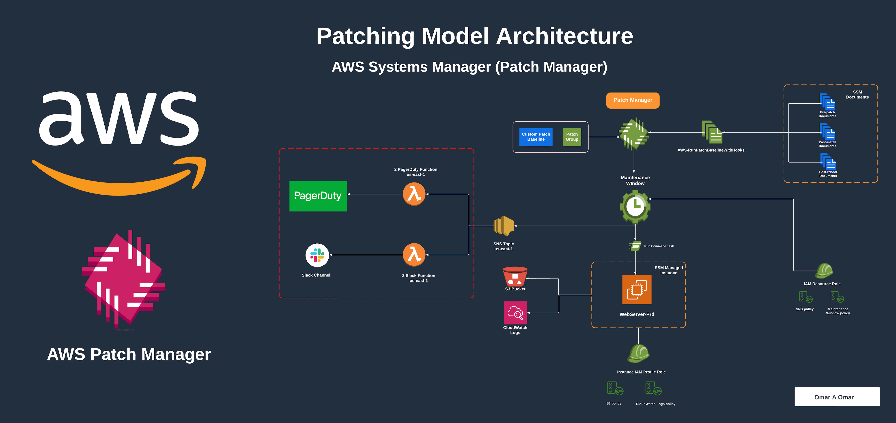

## Table of Contents
<!-- TOC -->
- [Patching Model using AWS Systems Manager - Patch Manager](#patching-model-using-aws-systems-manager---patch-manager )
    - [AWS Systems Manager Patch Manager](#aws-systems-manager-patch-manager)
      - [What is the Patch Baseline?](#what-is-the-patch-baseline)
      - [How Patch Baseline Rules Work on Amazon Linux 2](#how-patch-baseline-rules-work-on-amazon-linux-2)
    - [Patching Model Solution Architecture ](#patching-model-solution-architecture )
      - [Architecture Diagram](#architecture-diagram---patch-model-using-patch-manager)
    - [How to Create a Patching Model for a Single Managed Amazon Linux 2 EC2 Instance - Step by Step](#how-to-create-patching-model-for-single-managed-amazon-linux-2-ec2-instance---step-by-step)
      - [Prerequisites](#prerequisites)
        - [How to Create SSM Documents](#how-to-create-ssm-documents)
        - [Create IAM Service Role for Maintenance Window](#create-iam-service-role-for-maintenance-window)
            - [Create a policy](#create-a-policy)
            - [Create IAM resource role](#create-iam-resource-role)
        - [Create and add inline policies to the EC2 IAM instance profile](#create-and-add-inline-policies-to-the-ec2-iam-instance-profile)
      - [Step 1: Create a Custom Patch Baseline](#step-1-create-a-custom-patch-baseline)
      - [Step 2: Tagging the EC2 Instance with the Patch Group Key-Value](#step-2-assigning-a-patch-group-to-the-patch-baseline)
      - [Step 3: Assigning a Patch Group to the Patch Baseline](#step-3-creating-a-maintenance-window)
      - [Step 4: Creating a Maintenance Window](#step-4-registering-targets-to-the-maintenance-window)
      - [Step 5: Registering Targets to the Maintenance Window](#step-5-assigning-tasks-to-the-maintenance-window)
      - [Step 6: Assigning Tasks to the Maintenance Window](#step-6-assigning-patch-group-tag-to-the-targeted-amazon-linux-2-ec2-instance)
    - [Conclusion](#conclusion)
    

---


## AWS Systems Manager Patch Manager

Patch Manager is a capability of AWS Systems Manager. It applies and automates the patching process of managed nodes for both security related and other types of updates. It's capable of patching operating systems as well as applications. With the use of `patch baseline`, Patch Manager includes rules for auto-approving patches and for creating a list of approved or rejected patches. Patches can be installed individually or to a large groups of managed instances using tags. 
To schedule patching, Patch Manager runs tasks of `Maintenance Window`, which is another capability of Systems Manager. Although using Patch Manager is not the only patching option, it is one of the most straightforward and practical approaches. This patching model tutorial is to provide a proof of concept for patching a single managed Amazon Linux 2 instance. The tutorial's goal is to equip cloud teams the know-how they need to start using the Patch Manager. As a result, the tutorial's expertise and knowledge are to be applied to a fleet of managed instances or on-premises servers.

>Note: Patch Manager doesn't support upgrading major versions of operating systems.

### What is the Patch Baseline? 

Patch Manager provides predefined baselines for each supported operating systems. The service uses the native package manager to drive the installation of patches approved by the patch baseline.  For Amazon Linux 2, the predefined baseline is to approve all operating systems patches classified as `Security` and have a severity level of `Critical` or `Important`. The patches are auto-approved 7 days after release. Moreover, all patches classified `Bugfix` are also auto-approved 7 days after release. The predefined patch baseline are not customizable. However, it's feasible to create a custom patch baseline to control patch classifications, approval/rejection and auto-approve days after release. 


### How Patch Baseline Rules Work on Amazon Linux 2

Below is the guidelines for the packages selected for update: 

|      Security option             |        Equivalent Yum Command            |     
| :------------------------------- | :--------------------------------------- |  
| Pre-defined default patch baselines provided by Amazon (non-security updates option is not selected)    | `sudo yum update-minimal --sec-severity=critical,important --bugfix -y`      | 
| User Custom patch baselines (non-security updates option is selected)        | `sudo yum update --security --bugfix -y`      | 


Please, refer to [AWS documentation](https://docs.amazonaws.cn/en_us/systems-manager/latest/userguide/patch-manager-how-it-works-selection.html) for further information on how security patches are selected. 


---


## Patching Model Solution Architecture  

The plan is to utilize Patch Manager to develop a patching model for a single managed Amazon Linux 2 EC2 instance by using tags. Based on a scheduled maintenance window, an SSM Agent, installed on the EC2 instance, receives command issued to commence a patching process. The agent validates the instance's `Patch Group` tag-value and queries Patch Manager for an associated patch baseline. Once Patch Manager confirms the patch baseline for the Patch Group tag-value, it notifies the SSM Agent to retrieve the patch baseline snapshot. Finally, the SSM Agent begins scanning and installing patches based on the rules defined in the patch baseline snapshot provided by Patch Manager. 

The`AWS-RunPatchBaselineWithHooks` SSM document will be used to orchestrate multi-step installing patches. It offers three optional hooks which allows running SSM documents at three points during the patching cycle (pre-install, post-patch and post-reboot). We will create three simple SSM documents, as a proof of concept, to be used during the patching cycle. To read more about AWS-RunPatchBaselineWithHooks SSM document , please refer to [AWS blog](https://aws.amazon.com/blogs/mt/orchestrating-custom-patch-processes-aws-systems-manager-patch-manager/).

`Kernel Live Patching` is another feature available for Amazon Linux 2. It allows applying patches without the need for an immediate reboot or any disruption to running applications. We will not be using this feature for our patching model but I would like to recommend considering it. For more information about Kernel Live Patching, please refer to [AWS documentation](https://docs.aws.amazon.com/AWSEC2/latest/UserGuide/al2-live-patching.html). Please, bear in mind in case there is a need to run patching outside of the maintenance window for a fleet of instances, it's recommend by AWS, as best practice, to provide a **Snapshot-ID**. It ensures consistency among the targeted instances. Please, refer to [AWS documentation](https://docs.aws.amazon.com/systems-manager/latest/userguide/patch-manager-about-aws-runpatchbaseline.html#patch-manager-about-aws-runpatchbaseline-parameters-snapshot-id) for more information. In this patching model, we have allocated a `Patch Group` tag per instance; therefore, no snapshot id is needed for patching outside the maintenance window.

>Note: it's highly recommended to test the patching model in a development environment prior to deploying to production. Also, for multi-account and multi-region patching, please refer to [AW blog](https://aws.amazon.com/blogs/mt/centralized-multi-account-and-multi-region-patching-with-aws-systems-manager-automation/) for more information. 


### Architecture Diagram - Patching Model using Patch Manager

This patching model should work as a proof of concept. A similar concept to this architecture can be applied to fleets of managed EC2 instances and on-premises servers. 

<br/>

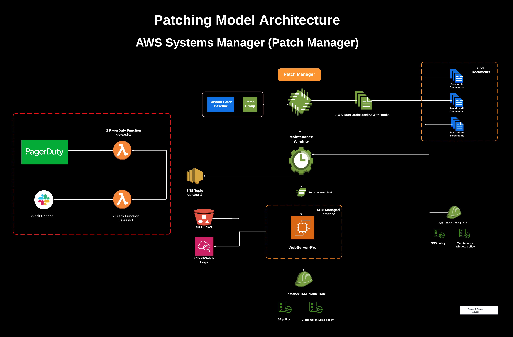

<br/>

>Note: the lambda functions to Slack channel and to PagerDuty are not included in this tutorial.

---

## How to Create Patching Model for Single Managed Amazon Linux 2 EC2 Instance - Step by Step

### Prerequisites

1. SSM Agent version 3.0.502 or later (requirement for the AWS-RunPatchBaselineWithHooks SSM document)
2. Internet connectivity. The managed instance must have access to the source patch repositories. 
3. Minimum operating system - Amazon Linux 2 2 - 2.0
4. IAM service role for Systems Manager to run Maintenance Window tasks
5. Optionally, adding policies to the IAM service role for SNS and CloudWatch logs
6. Optionally, a preconfigured S3 bucket to receive the patching command logs
7. Optionally, a preconfigured SNS topic for patching event notifications
8. Optionally, adding S3 and CloudWatch logs policies to the EC2 instance profile role 


---

<br />

### Step 1: Create a Custom Patch Baseline

1. Navigate to **AWS Systems Manager** console. Under **Node Management**, select **Patch Manager**.

<details>
<summary><b>Image 1</b></summary>

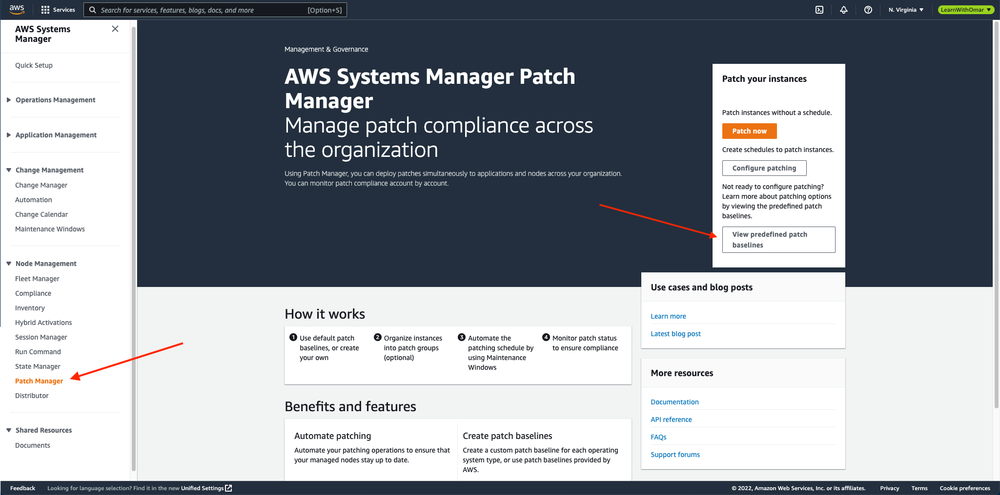

</details>

2. Select **View predefined patch baselines** and click on **Create patch baseline**. The, fill out the requirements as following:

    1. Under **Patch baseline details**: 
        1. Name: give the custom baseline a name such as, **AmazonLinux2AllPatchesBaseline**
        2. Description: optionally, add a description for the baseline such as, **Amazon Linux2 All Patches Baseline**
        3. Operating system: from the dropdown menu, select **Amazon Linux 2**
    2. Under **Approval rule for operating systems**: 
        1. Product: select **All**
        2. Classification: **All**
        3. Severity: **All**
        4. Auto-approval: leave the default selected option, **Approve patches after a specified number of days**
        5. Specify the number of days: leave the default **0** days
        6. Compliance reporting - optional: leave the default selected option, **Unspecified**
        7. Include nonsecurity updates: check the box to install nonsecurity patches
    3. Under **Patch exceptions**:
        1. Rejected patches - optional: add `system-release.*` as shown below. 
        2. Rejected patches action - optional: select **Block**
        
        >Note: the purpose of this block is to reject patches to new Amazon Linux releases beyond the Patch Manager supported operating systems.

    4. Under **Patch sources**: we will not add other source. Please, refer to [AWS documentation](https://docs.aws.amazon.com/systems-manager/latest/userguide/patch-manager-how-it-works-alt-source-repository.html) on how to define alternative patch source repository
    5. Under **Manage tags**: optionally define tags for the patch baseline


<details>
<summary><b>Image 2</b></summary>

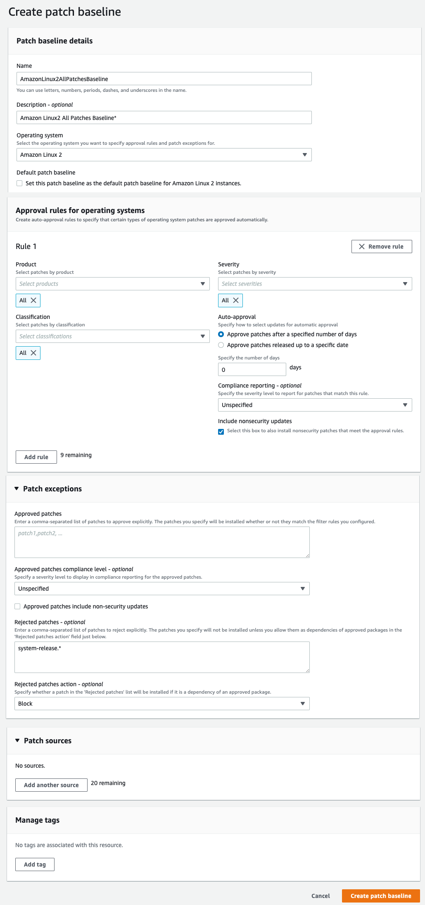

</details>


### Step 2: Assigning a Patch Group to the Patch Baseline

1. Navigate to **AWS Systems Manager** console. Under **Node Management**, select **Patch Manager**.
2. Click on **Patch baseline** tab and select the previously created custom baseline name **AmazonLinux2AllPatchesBaseline**.
3. Click on the **Baseline ID** which is leading to the baseline details page. 
4. On Actions button, select **Modify patch groups**. 
5. In the **Patch groups** textbox, type in the value we defined in step 2, which is **WebServer-Prd**. Then, click on **Add** button and **Close**.

<details>
<summary><b>Image 3 - 5</b></summary>

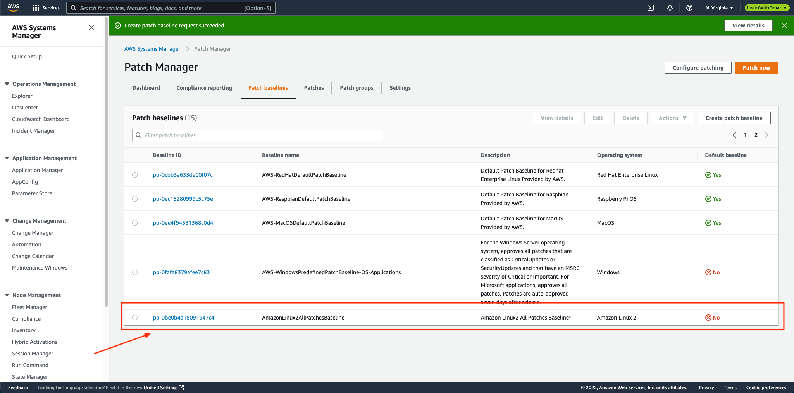
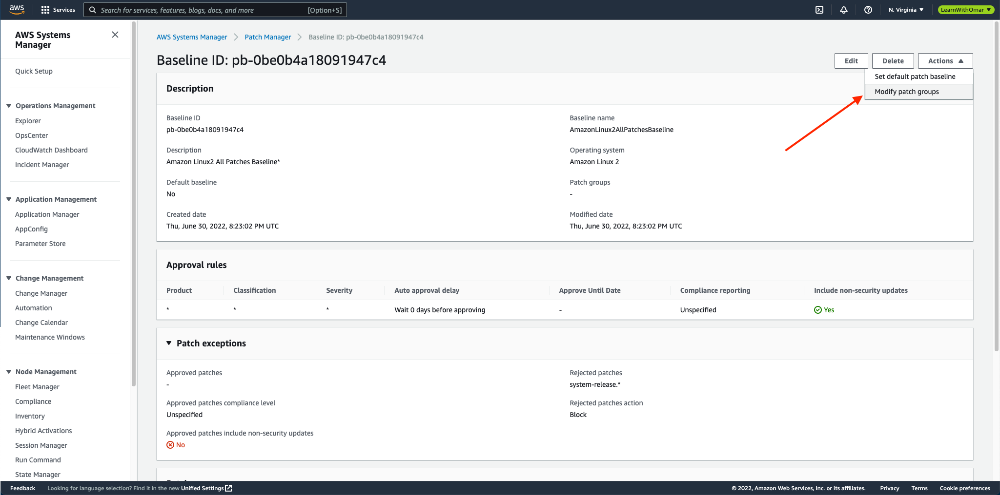
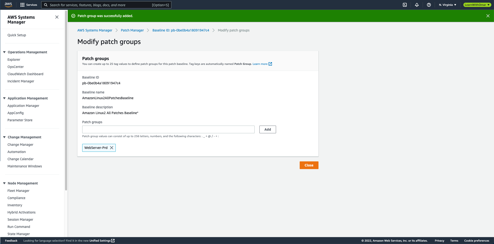

</details>


### Step 3: Creating a Maintenance Window

1. Navigate to **AWS Systems Manager** console. Under **Change Management**, select **Maintenance Windows**.
2. Click on **Create maintenance window** and fill out the requirements as following:

    1. Under **Provide maintenance window details**:
        1. Name: give the maintenance window a name such as, **Patch-WebServer-Prd**
        2. Description: optionally, add a description for the maintenance window such as, **Patching Maintenance Window for Patching WebServer in production**
        3. Unregistered targets: uncheck this option. If the option is selected, it allows to register instances that are not part of the targets.
    2. Under **Schedule**:
        1. Specify with: select **CRON/Rate expression**. For our scenario, we will run patching on the first Wednesday of each month at 9:00pm CDT. Therefore, the CRON job is **cron(0 21 ? * WED#1 *)**. We will define the timezone shortly. 
        >Note: for testing, you can use **Rate schedule** to the run the patching job every hour or so. Also, refer to [AWS documentation](https://docs.aws.amazon.com/systems-manager/latest/userguide/reference-cron-and-rate-expressions.html#reference-cron-and-rate-expressions-maintenance-window) for more information about cron and rate expressions for Systems Manager.  
        2. Duration: the number of hours the maintenance window will run. Type in **2**. 
        3. Stop initiating tasks: the number of hours before the end of the maintenance window that the systems should stop scheduling new tasks to run before the window closes. Type in **1**. 
        4. Window start date: select the starting date and time of this maintenance window such as, 7/6/2022 20:00pm GMT-05:00 (the GMT-05:00 is a conversion to US/Cental time). 
        5. Window end date: you may define an end date for the maintenance window. For our scenario, leave it empty. 
        6. Schedule timezone: select **US/Central** timezone. 

        >Note: the Central Daylight Time (CDT) is **-5** hours from **GMT**;therefore, the maintenance window is in affect starting from the 6th of July at 8:00pm CDT. 

        7. Schedule offset: leave it empty. 
    3. Under **Manage tags**: optionally define tags for the maintenance window
4. Finally, click on **Create maintenance window** to complete the process.

<details>
<summary><b>Image 6</b></summary>

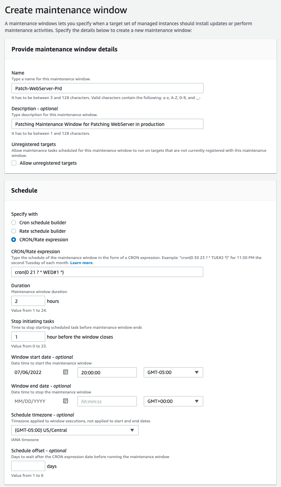

</details>

### Step 4: Registering Targets to the Maintenance Window

1. Navigate to **AWS Systems Manager** console. Under **Change Management**, select **Maintenance Windows**. Then, click **View details**. 
2. Press the **Actions** button and select **Register targets** from the dropdown menu. 
3. On the **Register target** screen under **maintenance window target details**, fill out the requirements as following:
    1. Name: give the targets a name such as, **WebServer-Prd**
    2. Description: optionally, add a description for the maintenance window such as, **The target is the Web Server in production**
    3. Owner information: optionally, you may specify a name of the owner such as, **The A-Engineering Team**
4. Under the **Targets** section, for **Target selection**, select **Specify instance tags**. Then, enter the patch group key-value tag that we created previously and click **Add** as shown below. 

|      Key                          |       Value                           |     
| :-------------------------------: | :---------------------------------------: |  
| Patch Group                       | WebServer-Prd       | 

5. Finally, click on **Register target** to complete the process.

<details>
<summary><b>Image 7 - 9</b></summary>

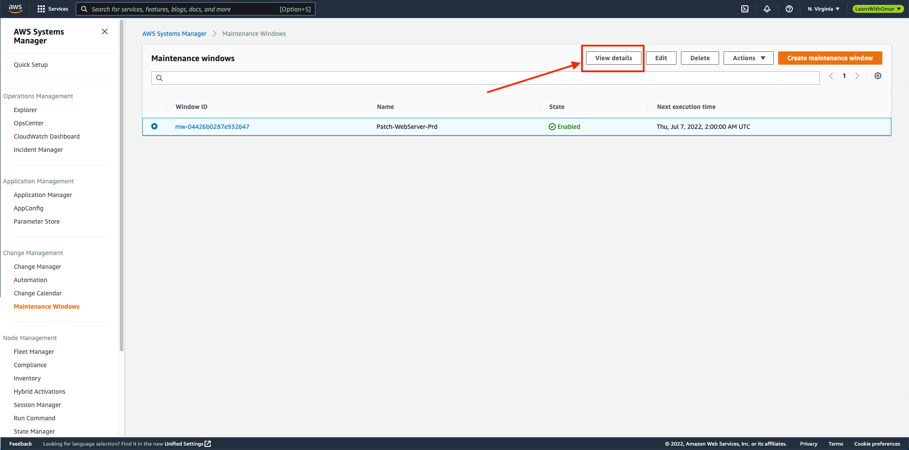
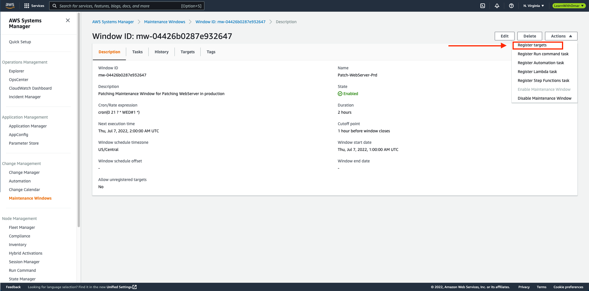
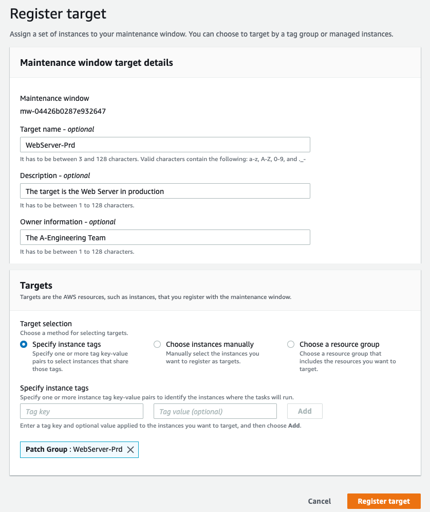

</details>

### Step 5: Assigning Tasks to the Maintenance Window

1. Navigate to **AWS Systems Manager** console. Under **Change Management**, select **Maintenance Windows**. Then, click **View details**. 
2. Press the **Actions** button and select **Register run command task** from the dropdown menu. 
3. On **Register Run command task** and Under **Maintenance window task details** section, fill out the requirements as following:
    1. Name: give the task a name such as, **PatchWebServerPrd**
    2. Description: optionally, add a description for the maintenance window such as, **Run Command Task for patching Patching Web Server in production**
    3. New task invocation cutoff: check **Enabled** to prevent new task invocations when the maintenance window cutoff time is reached
4. Under **Command document** section, search for `AWS-RunPatchBaselineWithHooks` and then select it. Leave **Document version** at the default selection **Default Version at runtime** and leave the **Task priority** at default value of **1**.

>Note: AWS-RunPatchBaselineWithHooks is a wrapper document for AWS-RunPatchBaseline document. It divides the patching into two events, before reboot and after reboot for a total of three hooks to support custom functionality. Refer to [About the AWS-RunPatchBaselineWithHooks SSM document](https://docs.amazonaws.cn/en_us/systems-manager/latest/userguide/patch-manager-about-aws-runpatchbaselinewithhooks.html) for more information.

5. For the **Targets** section, select **Selecting registered target groups** which is the default selection. Then, from the list select the target group that we assigned to the maintenance window. 
6. Under **Rate control**, 
    1. For **Concurrency**, leave it at default selection, **targets**, and type in **1**
    2. For **Error threshold**, leave it at default selection, **errors**, and type in **1**
7. On the **IAM service role**, select **maintenance-window-role** role from the dropdown menu. 

>Note: if the IAM service role is not created yet, refer to [Create IAM Service Role for Maintenance Window](#create-iam-service-role-for-maintenance-window) section. 

8. Under **Output options**, 
    1. Optionally, check **Enable writing to S3** and type the name of the preconfigured S3 bucket. In my case, it's **patching-webserver**.

     >Note: to capture the complete terminal output logs, configure an S3 bucket because only the last 2500 characters of a command output are displayed in the console. 

    2. Optionally, add an **S3 key prefix** such as, `patching/webserver/prd`
    3. Check **CloudWatch output** and, optionally, type in a name for the **Log group** such as, `patching/webserver/prd`

    >Note: we will have to give the required permissions to the EC instance IAM profile role to put objects to S3 and put logs to CloudWatch.

9. For the **SNS notifications** section
    1. Check **Enable SNS notifications**
    2. Select the preconfigured **IAM role** for the SNS service. In our case, it's maintenance-window-role because we have added an SNS policy to it.
    3. Paste the **SNS topic** ARN
    4. For **Event type**, leave it at default selection which is **All** events
    5. For **Notification type**, select **Per instance basis notification when the command status on each instance changes** 
10. Under the **Parameters** section:
    1. For **Operation**, select **Install** from the dropdown menu
    2. Snapshot Id, leave it empty
    3. Reboot Option: leave it at default value, **RebootIfNeeded**
    4. Pre Install Hook Doc Name: type in the name of the pre install document
    5. Post Install Hook Doc Name: : type in the name of the post install document
    6. On Exit Hook Doc Name: type in the name of the on-exit document
    7. Comment: optionally, add comments about the command
    8. Timeout (seconds): leave it at default value, **600**
    9. Finally, click **Register Run command task**

    >Note: for details on how to create documents, refer to [How to Create SSM Document](#how-to-create-ssm-documents) section. If you don't want to use any of the three hooks, then leave it at default value, which is **AWS-Noop**. 
  
<details>
<summary><b>Image 10 - 11</b></summary>

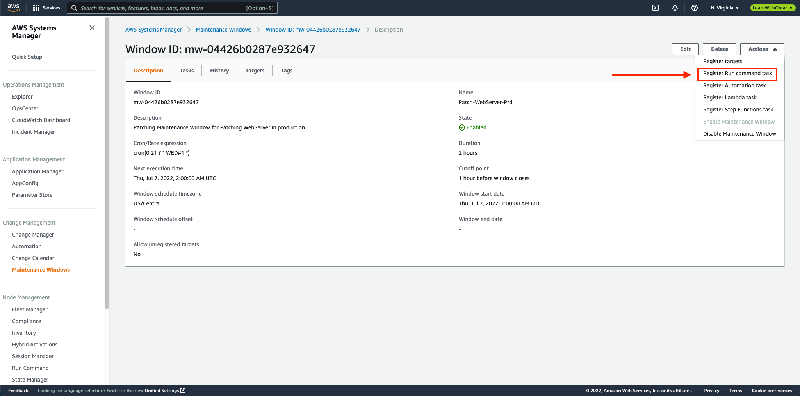
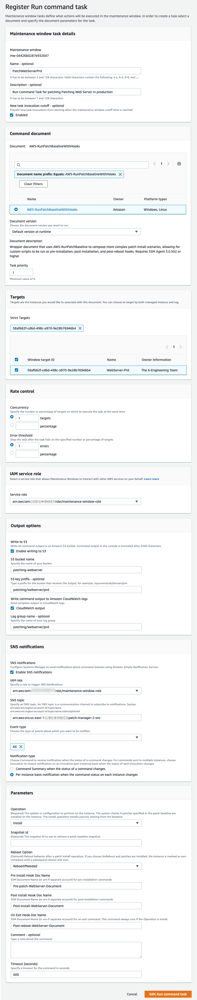

</details>

### Step 6: Assigning Patch Group Tag to the Targeted Amazon Linux 2 EC2 Instance

1. Navigate to **AWS Systems Manager** console. Under **Node Management**, select **Fleet Manager**.
2. From the **Managed nodes** list tab, select the EC3 that is targeted for patching. Then, click on **Node actions** and select **View details** from dropdown menu. 
3. From the **Tags** tab, click **Edit** to add the below tag key-value and then press the **Save** button:

    |      Key                          |       Value                           |     
    | :-------------------------------: | :---------------------------------------: |  
    | Patch Group                       | WebServer-Prd       | 


<details>
<summary><b>Image 12 - 14</b></summary>

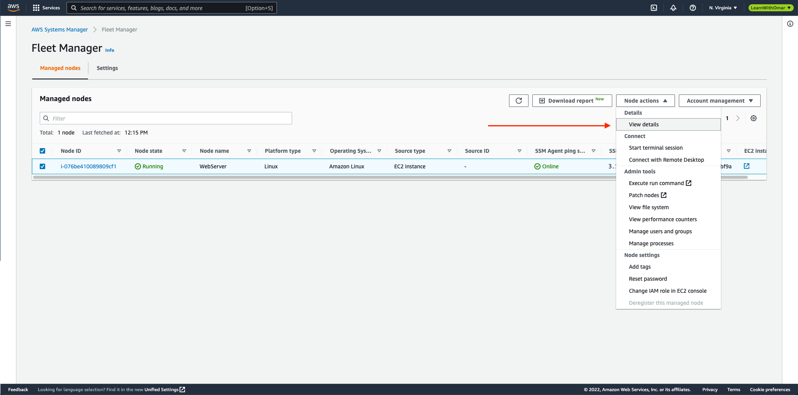
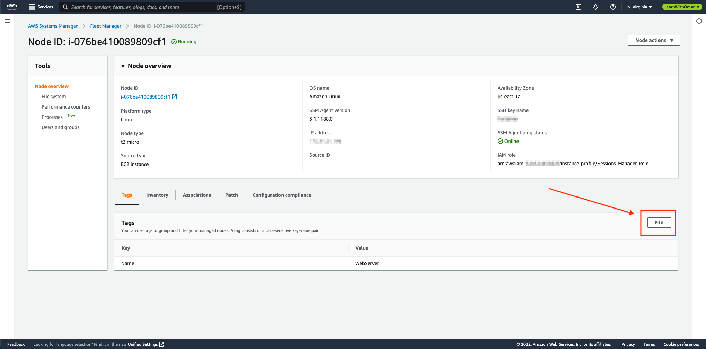
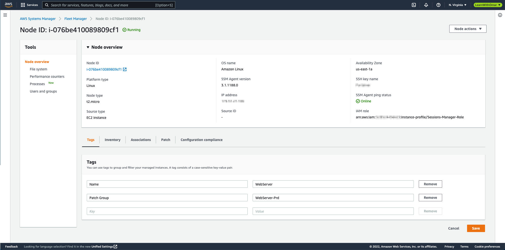

</details>

---

<br />

## How to Create SSM Documents

We will create three simple documents as a proof of concept. Please, refer to [AWS documentation](https://docs.aws.amazon.com/systems-manager/latest/userguide/create-ssm-doc.html) for more details about creating SSM documents. 

1. Navigate to **AWS Systems Manager** console. Under **Shared Resources**, select **Documents**.
2. Click **Create document** button and select **Command or Session** from the dropdown menu.
3. On the **Create document** screen:
    1. Name: give the document a name such as, **Pre-patch-WebServer-Document**
    2. Target type: leave it empty 
    3. Document type: leave it at default which is **Command document** 
    4. Content: replace the default content with the below into the **YAML** editor
    5. Document tags: optionally add key-value tag to the document
    6. Finally, click **Create document**

<details>
<summary><b>Image 15</b></summary>

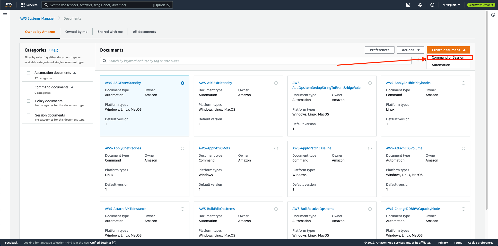

</details>

```
---
schemaVersion: '2.2'
description: Pre-patch Web Server Document
parameters: {}
mainSteps:
- action: aws:runShellScript
  name: configureServer
  inputs:
    runCommand:
    - sudo systemctl status httpd
```

4. Repeat the process from bullet #3 for `Post-install-WebServer-Document` and `Post-reboot-WebServer-Document`. The **YAML** contents are below. 


```
---
schemaVersion: '2.2'
description: Post-install Web Server Document
parameters: {}
mainSteps:
- action: aws:runShellScript
  name: configureServer
  inputs:
    runCommand:
    - sudo systemctl stop httpd
```

```
---
schemaVersion: '2.2'
description: Post-reboot Web Server Document
parameters: {}
mainSteps:
- action: aws:runShellScript
  name: configureServer
  inputs:
    runCommand:
    - sudo systemctl start httpd
    - sudo systemctl status httpd
```


<details>
<summary><b>Image 16</b></summary>

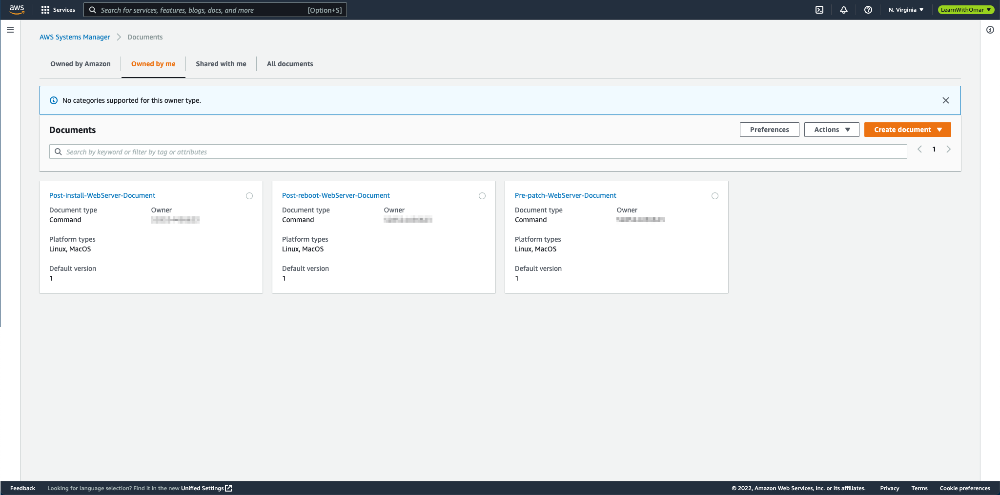

</details>

--- 

<br />

## Create IAM Service Role for Maintenance Window

As Systems Manager needs permissions to run maintenance window tasks, below are the steps to create the required IAM role:

### Create a policy:

1. From the **IAM** console, navigate to **Policies** and click **Create policy** button.
2. Click on the **JSON** tab and after clearing the default content, paste the below policy and click **Next:Tags**.

```
{
    "Version": "2012-10-17",
    "Statement": [
        {
            "Effect": "Allow",
            "Action": [
                "ssm:SendCommand",
                "ssm:CancelCommand",
                "ssm:ListCommands",
                "ssm:ListCommandInvocations",
                "ssm:GetCommandInvocation",
                "ssm:ListTagsForResource",
                "ssm:GetParameters"
            ],
            "Resource": "*"
        },
        {
            "Effect": "Allow",
            "Action": [
                "resource-groups:ListGroups",
                "resource-groups:ListGroupResources"
            ],
            "Resource": [
                "*"
            ]
        },
        {
            "Effect": "Allow",
            "Action": [
                "tag:GetResources"
            ],
            "Resource": [
                "*"
            ]
        },
        {
            "Effect": "Allow",
            "Action": [
                "sns:Publish"
            ],
            "Resource": [
                "arn:aws:sns:*:*:*"
            ]
        },
        {
            "Effect": "Allow",
            "Action": "iam:PassRole",
            "Resource": "*",
            "Condition": {
                "StringEquals": {
                    "iam:PassedToService": [
                        "ssm.amazonaws.com"
                    ]
                }
            }
        }
    ]
}
```

3. Optionally, add tag-key value pairs and click **Next:Review**.
4. Give the policy a name and description such as:
    a. Name: **maintenance-window-policy**
    b. Description: **The policy allows Systems manager to run maintenance window tasks**
5. Finally, click **Create policy** 

### Create IAM resource role:

1. From the **IAM** console, navigate to **Roles** and click **Create role** button.
2. For **Select trusted entity** page:
    1. Trusted entity type: leave at default, **AWS service**
    2. Use case - Use cases for other AWS services: search for **Systems Manager** and select it (NOT Systems Manager - Inventory and Maintenance Windows)
    3. Click **Next**
3. On **Add permissions** screen, search for the previously created policy, **maintenance-window-policy** and select it. Click **Next**
4. Give the role a name such as, **maintenance-window-role** and click **Create role**.

<details>
<summary><b>Image 17 - 19</b></summary>

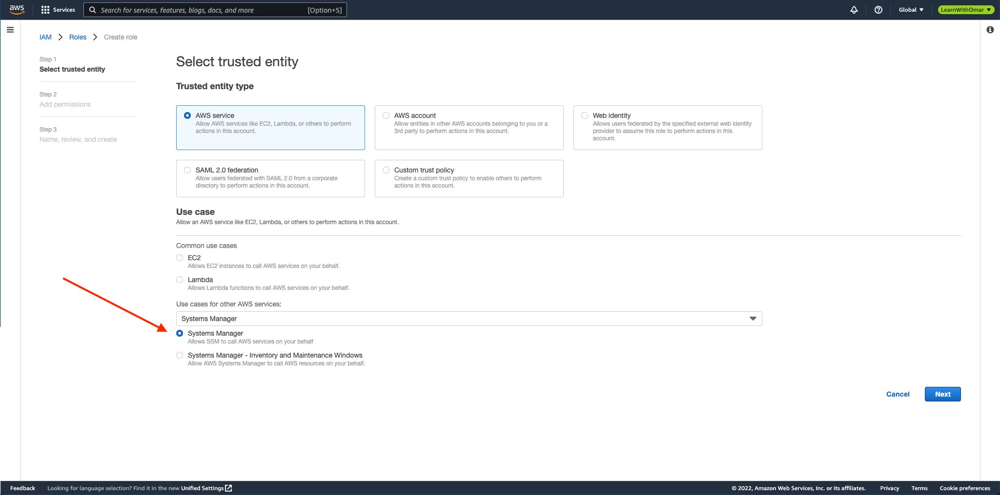
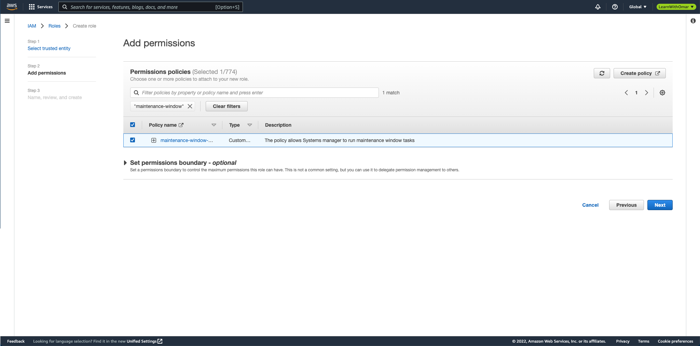
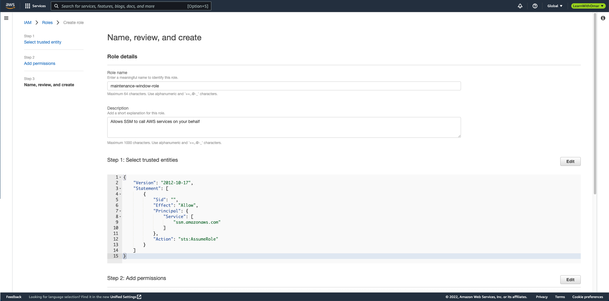

</details>


## Create and add inline policies to the EC2 IAM instance profile:

The EC2 instance profile requires necessary permissions to write data to an S3 bucket and to put log events to CloudWatch. We will create inline policies to assign the required permissions to the EC2 instance profile.

1. From the **IAM** console, navigate to **Roles** and search for your EC2 instance profile role. Then, click on the **Role name**.
2. Under **Permissions* tab:
    1. From **Add permissions** button, select **Create inline policy** from the dropdown menu
    2. Select the **JSON** tab and replace the default content with the below policy:

```
{
"Version": "2012-10-17",
"Statement": [
    {
        "Effect": "Allow",
        "Action": "s3:PutObject",
        "Resource": "*"
    }
    ]
}
```

    3. Click **Review policy**
    4. On the **Review policy** page, give the policy a name such as, `S3-Put-Instance-Profile`
    5. Finally, click **Create policy**
3. Repeat the process from bullet 2 to create an inline policy to allow the EC2 instance to create log stream and to put log events to CloudWatch. Use the below inline policy:

```
{
    "Version": "2012-10-17",
    "Statement": [
        {
            "Sid": "VisualEditor0",
            "Effect": "Allow",
            "Action": [
                "logs:CreateLogStream",
                "logs:PutLogEvents",
                "logs:CreateLogGroup"
            ],
            "Resource": "*"
        }
    ]
}
```


<br />

---


## Conclusion


Patch Manager is an effective and powerful tool. It assists cloud teams in managing security risks and addressing vulnerabilities by automating the patching process. By the end of the tutorial, we have learned how to schedule patches for a single managed Amazon Linux 2 instance using Patch Manager and its features. Now that we have this knowledge, we can use it to create a patching model that is more intricate for a fleet of managed instances or on-premises servers.

I hope this tutorial helps you learn more about Patch Manager and how to use it for your patching models.

[Omar A Omar](https://omar2cloud.github.io/)

July 6th, 2022


<br>

---
